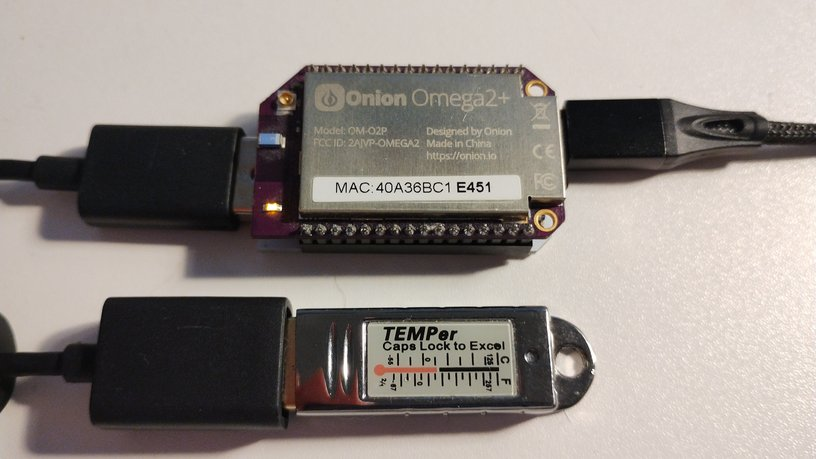
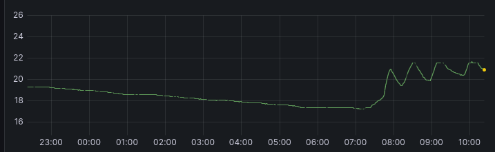

# temper-exporter
A small program to allow recording of temperature data from a cheap USB probe attached to a IoT device, using a Onion Omega 2+ device as part of the testing.




# Goals
The goal of the project was to:
- Golang:
    - Cross compile on mips device
    - Read and convert binary information from USB probe
    - Create Prometheus client/scrape point
- Promentheus/Grafana
    - Create Prometheus scrape configuration
    - Create Grafana dashboard plotting temperature

# How to deploy
## Find device number
Plug in the TEMPer device, and check last line of `dmesg`, typically you will see that the device is available on `/dev/hidraw1`, where "1" wil be your device number to use

## Run

Either run locally using (you will need access to raw device, in this case we use "1" as the device number):
```
# go run . 1
```
## Build
To cross compile for the Omega / mips architecture,
```
# make omega
```
and copy the `temper` binary to the Onion device. Note that it is a single binary with included web server, thus ~15 mb in size.

# Prometheus/Grafana
If you have Prometheus/Grafana deployed on Kuberetes, you can create a scrape object:

```yaml
apiVersion: monitoring.coreos.com/v1alpha1
kind: ScrapeConfig
metadata:
  name: temper
  namespace: monitoring
  labels:
    prometheus: system-monitoring-prometheus
spec:
  staticConfigs:
    - labels:
        job: temper
      targets:
        - <IP of your device/localhost>:9100
```